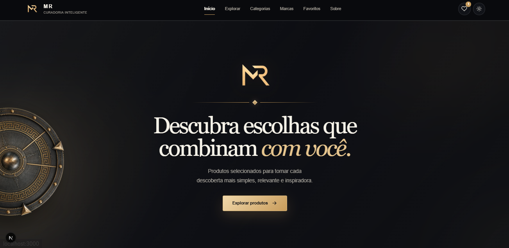
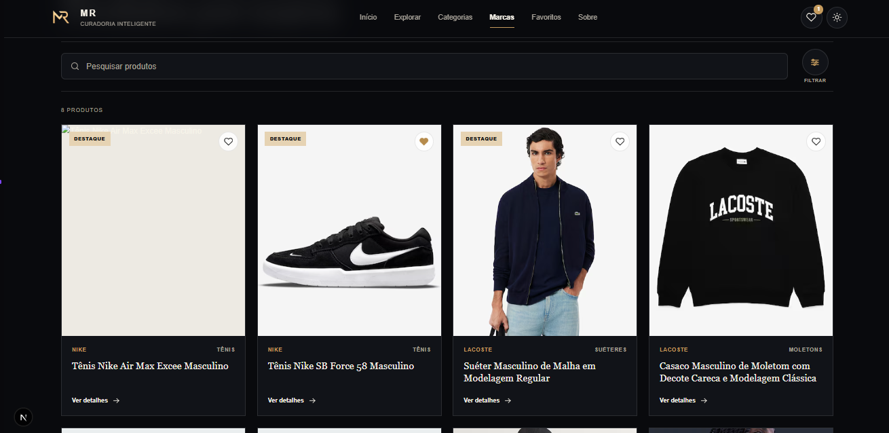

# MR Commerce Platform

<div align="center">


<br>

### Plataforma web full-stack para catálogo, descoberta e organização de produtos.

<br>


</div>

<br>

# `> PROJECT.OVERVIEW`

## MR Commerce Platform

A **MR Commerce Platform** é uma aplicação web full-stack desenvolvida para explorar a construção de uma plataforma moderna de comércio digital.

O sistema possui uma arquitetura separada entre **frontend, backend e banco de dados**, permitindo que cada camada seja desenvolvida e evoluída de maneira independente.

O projeto foi construído como um ambiente prático para aplicação de conceitos de:

* Desenvolvimento Full Stack
* Engenharia de Software
* Arquitetura cliente-servidor
* APIs
* Banco de dados
* Validação de dados
* Segurança
* Testes
* Responsividade
* Integração entre sistemas
* Organização e modularização de software

Atualmente, a plataforma representa um **MVP técnico em desenvolvimento**, servindo como base para futuras funcionalidades relacionadas a comércio eletrônico, integrações e gerenciamento de produtos.

<br>

<div align="center">


</div>

<br>

# `> CORE.TECH_STACK`

<div align="center">

## Tecnologias

### Linguagens

<br>


<br><br>

### Front-end

<br>


<br><br>

### Back-end

<br>


<br><br>

### Banco de Dados

<br>


<br><br>

### Ferramentas & Desenvolvimento

<br>


<br><br>


</div>

<br>

# `> PROJECT.PREVIEW`

<div align="center">

## Interface da plataforma

A MR possui uma identidade visual própria baseada em **tons escuros, dourado, alto contraste e composição minimalista**.

<br>

### `HOME`

<br>



<br><br>

**Página inicial da MR Commerce Platform**

<br><br><br>

### `CATÁLOGO`

<br>



<br><br>

**Interface de exploração e descoberta de produtos**

</div>

<br>

# `> DESIGN.SYSTEM`

## Identidade visual

A interface da MR foi desenvolvida buscando transmitir uma experiência visual organizada, moderna e sofisticada.

A composição utiliza principalmente:

<div align="center">


</div>

<br>

### Princípios visuais

* Interface predominantemente escura
* Dourado utilizado como cor de destaque
* Alto contraste
* Espaçamento consistente
* Hierarquia tipográfica
* Navegação objetiva
* Componentes minimalistas
* Ênfase visual nos produtos
* Identidade própria para a MR

O objetivo é equilibrar **sofisticação, clareza e funcionalidade** sem sobrecarregar a experiência.

<br>

# `> SYSTEM.FEATURES`

## Funcionalidades atuais

### Catálogo

* Listagem de produtos
* Consulta de produtos
* Exploração do catálogo
* Organização por categorias
* Organização por marcas
* Consulta individual de produtos
* Comunicação entre frontend e API

### Interface

* Layout responsivo
* Identidade visual própria
* Navegação estruturada
* Componentização
* Sistema de favoritos
* Gerenciamento de tema
* Páginas institucionais
* Estrutura preparada para evolução

### Backend

* API HTTP
* Arquitetura modular
* Rotas de catálogo
* Rotas de produtos
* Módulo de afiliados
* Validação de dados
* Comunicação com MySQL
* Health Check
* CORS
* Rate Limiting
* Headers de segurança
* Variáveis de ambiente

### Qualidade

* TypeScript
* ESLint
* Testes automatizados
* Testes de integração
* Vitest
* Scripts de desenvolvimento
* Build separado entre frontend e backend

<br>

# `> SYSTEM.ARCHITECTURE`

<div align="center">

## Arquitetura da aplicação

</div>

```text
                         ┌─────────────────────────┐
                         │        USUÁRIO          │
                         │                         │
                         │    Browser / Mobile     │
                         └────────────┬────────────┘
                                      │
                                      ▼
                 ┌─────────────────────────────────────┐
                 │              FRONTEND               │
                 │                                     │
                 │       Next.js + React + TypeScript  │
                 │                                     │
                 │     Interface • Navegação • UX      │
                 └──────────────────┬──────────────────┘
                                    │
                                    │ HTTP / API
                                    ▼
                 ┌─────────────────────────────────────┐
                 │               BACKEND               │
                 │                                     │
                 │       Node.js + Fastify + Zod       │
                 │                                     │
                 │       API • Regras • Validação      │
                 └──────────────────┬──────────────────┘
                                    │
                                    ▼
                 ┌─────────────────────────────────────┐
                 │              DATABASE               │
                 │                                     │
                 │                MySQL                │
                 │                                     │
                 │        Produtos • Catálogo          │
                 └─────────────────────────────────────┘
```

A separação entre **interface, API e persistência de dados** permite reduzir o acoplamento entre as diferentes responsabilidades da aplicação.

Essa arquitetura também facilita manutenção, testes e evolução futura do sistema.

<br>

# `> STACK.DETAILS`

## Front-end

| Tecnologia       | Utilização                           |
| ---------------- | ------------------------------------ |
| **Next.js**      | Framework principal da aplicação web |
| **React**        | Construção da interface              |
| **TypeScript**   | Tipagem e desenvolvimento            |
| **Tailwind CSS** | Estilização                          |
| **Lucide React** | Sistema de ícones                    |
| **next-themes**  | Gerenciamento de temas               |

<br>

## Back-end

| Tecnologia     | Utilização              |
| -------------- | ----------------------- |
| **Node.js**    | Runtime do servidor     |
| **Fastify**    | Construção da API       |
| **TypeScript** | Tipagem do backend      |
| **Zod**        | Validação de dados      |
| **MySQL2**     | Comunicação com o banco |
| **dotenv**     | Variáveis de ambiente   |
| **Vitest**     | Testes automatizados    |

<br>

## Banco de Dados

<div align="center">


### MySQL

</div>

O MySQL é utilizado para persistência dos dados utilizados pelos módulos da aplicação.

<br>

# `> PROJECT.STRUCTURE`

```text
mr-commerce-platform/
│
├── web/
│   │
│   ├── public/
│   │
│   ├── src/
│   │   ├── app/
│   │   ├── components/
│   │   └── lib/
│   │
│   ├── tests/
│   └── package.json
│
├── server/
│   │
│   ├── src/
│   │   ├── config/
│   │   ├── database/
│   │   │
│   │   ├── modules/
│   │   │   ├── affiliate/
│   │   │   ├── catalog/
│   │   │   └── products/
│   │   │
│   │   ├── routes/
│   │   └── server.ts
│   │
│   ├── tests/
│   └── package.json
│
├── .github/
│   └── assets/
│       ├── home.png
│       └── catalogo.png
│
├── INSTALAR-MR.ps1
├── INICIAR-MR.ps1
├── PARAR-MR.ps1
├── VALIDAR-MR.ps1
│
└── package.json
```

<br>

# `> GETTING.STARTED`

## Executando localmente

### Pré-requisitos

Antes de executar o projeto, tenha instalado:

* Node.js
* npm
* MySQL
* Git

<br>

## 1. Clone o projeto

```bash
git clone https://github.com/restoffkaua08-afk/mr-commerce-platform.git
```

Entre na pasta:

```bash
cd mr-commerce-platform
```

<br>

## 2. Instale o backend

```bash
cd server
npm install
```

<br>

## 3. Instale o frontend

```bash
cd ../web
npm install
```

<br>

# `> ENVIRONMENT.CONFIG`

O sistema utiliza variáveis de ambiente para armazenar configurações locais e informações que não devem ser adicionadas diretamente ao código-fonte.

Utilize os arquivos de exemplo existentes no projeto como referência.

```text
.env.example
      │
      ▼
.env.local
```

### Importante

Nunca publique:

```text
.env
.env.local
senhas
tokens
API keys
credenciais de banco
chaves privadas
```

Esses arquivos devem permanecer fora do versionamento.

<br>

# `> RUN.APPLICATION`

## Backend

Abra um terminal:

```powershell
cd server
npm run dev
```

<br>

## Frontend

Abra outro terminal:

```powershell
cd web
npm run dev
```

Após a inicialização, o Next.js informará o endereço local da aplicação.

Normalmente:

```text
http://localhost:3000
```

<br>

# `> DEVELOPMENT.WORKFLOW`

O projeto também possui scripts auxiliares para facilitar operações locais.

### Instalação

```text
INSTALAR-MR.ps1
```

Auxilia na preparação do ambiente do projeto.

### Inicialização

```text
INICIAR-MR.ps1
```

Auxilia na inicialização dos serviços necessários.

### Encerramento

```text
PARAR-MR.ps1
```

Auxilia no encerramento dos processos relacionados à aplicação.

### Validação

```text
VALIDAR-MR.ps1
```

Utilizado para auxiliar na validação do ambiente e do sistema.

<br>

# `> QUALITY.ASSURANCE`

## Testes

### Backend

```bash
npm --prefix server test
```

### Frontend

```bash
npm --prefix web test
```

### Testes gerais

```bash
npm run test
```

<br>

## Lint

```bash
npm run lint
```

<br>

## Build

```bash
npm run build
```

Essas verificações auxiliam na manutenção da qualidade e consistência da aplicação durante seu desenvolvimento.

<br>

# `> SECURITY`

O projeto utiliza práticas voltadas à segurança e organização da aplicação.

Entre elas:

* Variáveis de ambiente
* Validação de entradas
* Zod
* CORS
* Rate Limiting
* Headers de segurança
* Separação entre frontend e backend
* Arquivos sensíveis fora do versionamento

<br>

<div align="center">


</div>

<br>

# `> PROJECT.ROADMAP`

## Próximas etapas

A MR Commerce Platform continuará evoluindo gradualmente.

* [ ] Evoluir a página individual de produtos
* [ ] Implementar carrinho de compras
* [ ] Criar autenticação
* [ ] Desenvolver área do cliente
* [ ] Criar sistema de pedidos
* [ ] Desenvolver checkout
* [ ] Integrar meios de pagamento
* [ ] Integrar fornecedores
* [ ] Implementar rastreamento de pedidos
* [ ] Criar painel administrativo
* [ ] Evoluir sistema de favoritos
* [ ] Implementar avaliações
* [ ] Melhorar busca e filtros
* [ ] Preparar infraestrutura de produção
* [ ] Realizar deploy público

> Os itens acima representam funcionalidades planejadas e não necessariamente recursos disponíveis na versão atual.

<br>

# `> ENGINEERING.PRINCIPLES`

> **Uma boa interface chama atenção. Uma boa arquitetura permite que ela continue evoluindo.**

O desenvolvimento da MR segue alguns princípios fundamentais.

### Organização

Responsabilidades devem permanecer claramente separadas.

### Modularidade

Novas funcionalidades devem poder ser adicionadas sem exigir a reconstrução completa do sistema.

### Experiência

A tecnologia deve servir à experiência do usuário.

### Manutenibilidade

Código deve ser compreensível e preparado para evolução.

### Evolução incremental

Um sistema não precisa nascer completo.

Ele precisa possuir uma base sólida o suficiente para receber as próximas funcionalidades.

<br>

# `> PROJECT.STATUS`

<div align="center">

## 🚧 Desenvolvimento ativo

A **MR Commerce Platform** atualmente representa um MVP técnico em evolução.

<br>


<br><br>

O objetivo é continuar transformando a plataforma em uma aplicação mais completa, robusta e próxima de um ambiente real de produção.

</div>

<br>

# `> DEVELOPER`

<div align="center">

## Kauã Restoff

### Desenvolvedor de Software

Projeto desenvolvido como parte da minha evolução prática em **Desenvolvimento Full Stack e Engenharia de Software**.

<br><br>

<a href="https://github.com/restoffkaua08-afk">
  
</a>

 

<a href="https://www.linkedin.com/in/kau%C3%A3-restoff-2821163a0">
  
</a>

 

<a href="https://restoff-dev.vercel.app">
  
</a>

</div>

<br>

---

<br>

<div align="center">

## `BUILD • TEST • EVOLVE`

**Transformando uma ideia em uma plataforma real, uma versão de cada vez.**

<br>

`NEXT.JS` • `REACT` • `TYPESCRIPT` • `FASTIFY` • `MYSQL`

<br><br>


<br><br>


<br><br><br>

**MR Commerce Platform © 2026**

**Desenvolvido por Kauã Restoff**

<br><br>


</div>
